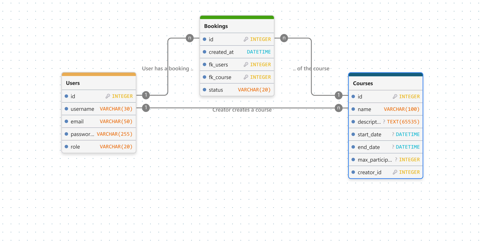
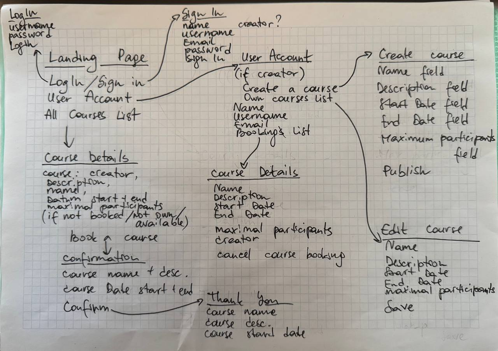
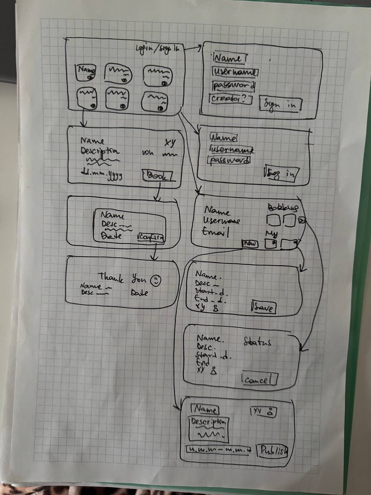

# Projektarbeit
## Problemstellung
Als Künstlerin, die Schmuck selber erstellt, bekomme ich immer Fragen, wie ich die einzelnen Schmuckstücke gemacht habe.
Es ist mir zu aufwändig, allen Interessierten denselben Prozess immer zu zeigen. Ausserdem wünschte ich mir gerne einen verallgemeinerten Austausch mit den anderen Künstlern.
## Projekt
* Domäne: Kunst und Buchungsverwaltung
* Name der Applikation: AllAroundJewelry
* Vision: AllAroundJewelry wird entwickelt, um die Schmuck- Macher sowie die Interessierte auf einer Plattform zu verbinden, welche den Austausch zwischen beiden erleichtert und fördert.
## Projektplanung: 1. MVP Iteration
Die wichtigste funktionale Anforderung für die erste Iteration ist die Erstellung und Verwaltung von einzelnen Kursen. Dies umfasst das Erstellen von Kursen und die entsprechende Buchung.
## Anforderungsanalyse
### Funktionale Anforderungen (priorisiert)
* Benutzer können sich registrieren und einloggen
* Benutzer können zu Schmuckersteller werden
* Kurse können erstellt, bearbeitet und gelöscht werden
* Kurse können von Benutzer gebucht werden
* Benutzer können ihr Profil bearbeiten und ihre E-Mail-Adresse ändern
* Benutzer können ihr Passwort zurücksetzen
### Qualitätsattribute
* Benutzerfreundlichkeit: Eine Buchung ist von der Kursübersicht aus in höchstens drei Klicks abgeschlossen.
* Skalierbarkeit: Unterstützung von mindestens 10.000 gleichzeitigen Benutzern.
* Sicherheit: Passwörter werden nur als bcrypt-Hash gespeichert; Kurse bearbeiten kann ausschliesslich der erstellende Schmuckersteller. 
* Datenkonsistenz: Bei zwei gleichzeitigen Reservierungen des letzten freien Platzes wird genau eine bestätigt.
* Kompatibilität: Unterstützung aller gängigen Webbrowser und mobilen Geräte.
### Benutzerrollen
* Benutzer: Kann alle öffentliche Kurse anschauen und buchen.
* Schmuckersteller: Kann eigene Kurse erstellen, bearbeiten und löschen, kann andere Kurse auch buchen.
## Locking und Transaktionen 
Kursbuchung: Beim Buchen von Kursen mit dem begrenzten Benutzeranzahl, muss geprüft werden, ob noch Plätze frei sind, und gleichzeitig die Buchung erstellt werden. Zwischen Prüfung und Speicherung kann ein anderer Benutzer denselben letzten Platz buchen (Race Condition). Deshalb wird der Kurs innerhalb einer Transaktion pessimistisch gesperrt (kurs.with_lock), damit die Platzzahl nie überschritten wird. Zusätzlich verhindert ein Unique Index auf (kurs_id, benutzer_id), dass jemand sich versehentlich doppelt anmeldet.
## ERM (Entity-Relationship-Model)
fk_users und fk_course sind in der Tabelle Unique Index, users.role und booking.status sind enums.

## Breadboards

## Fat-Marker-Sketches

