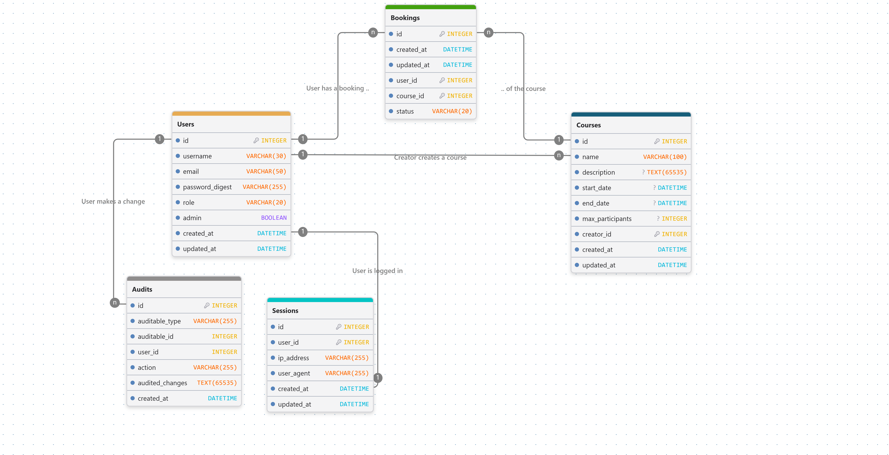
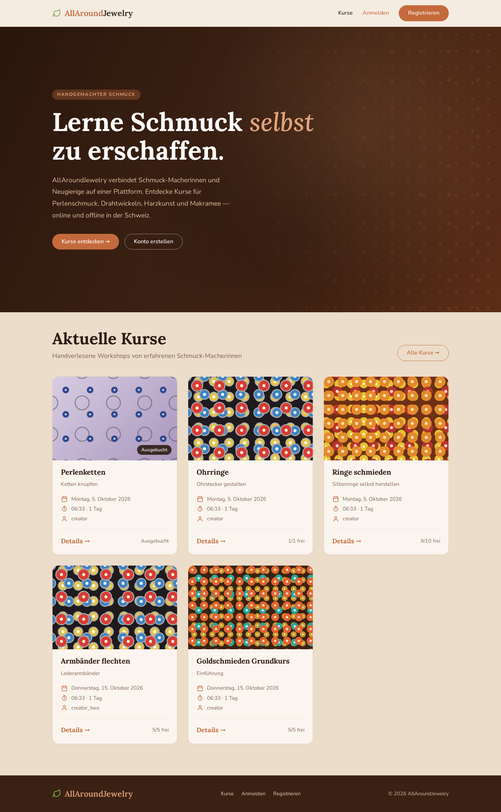
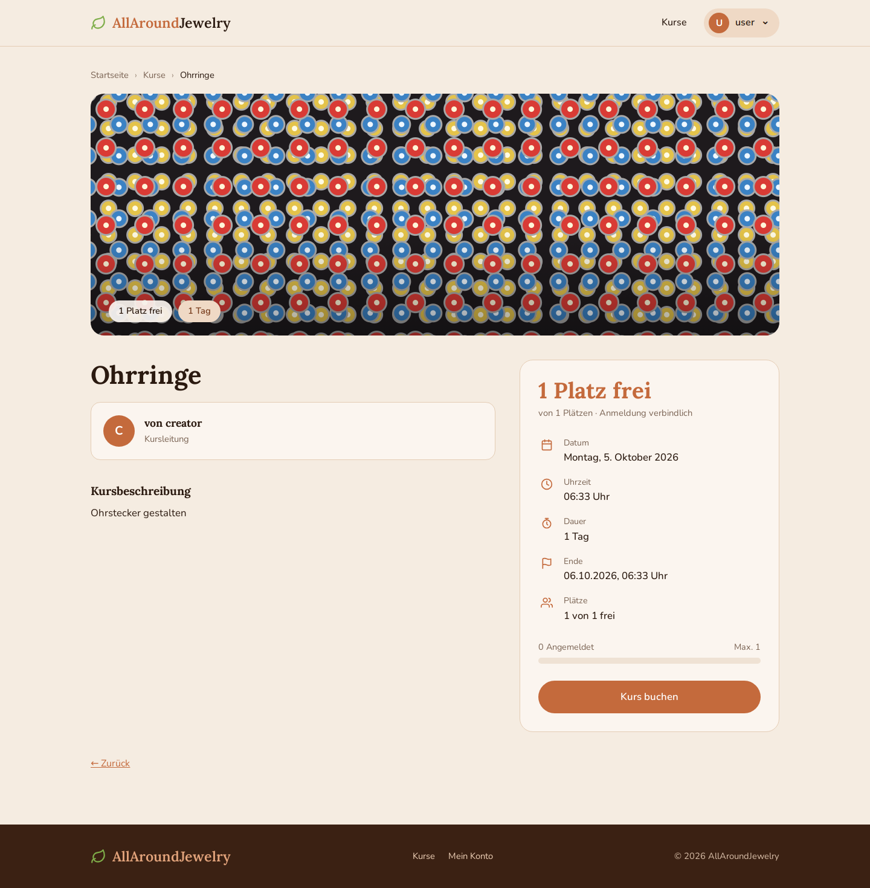
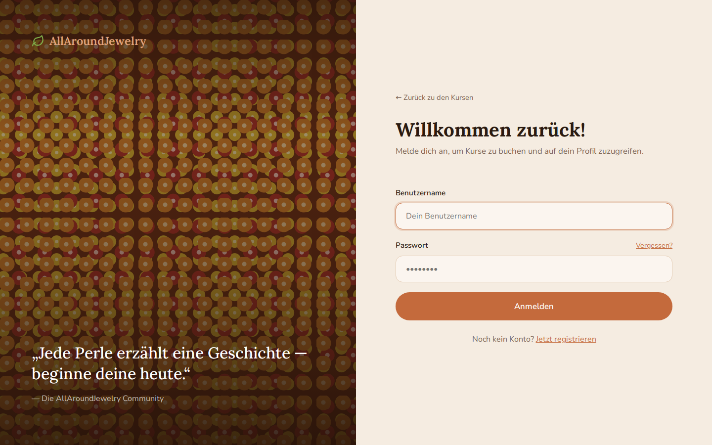
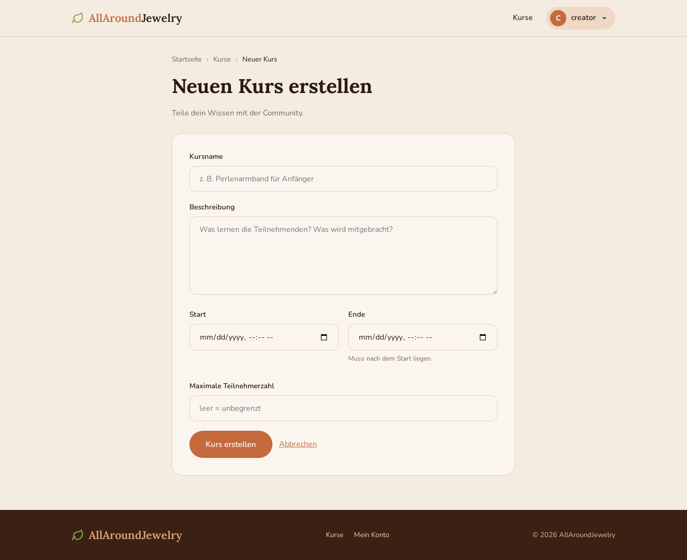
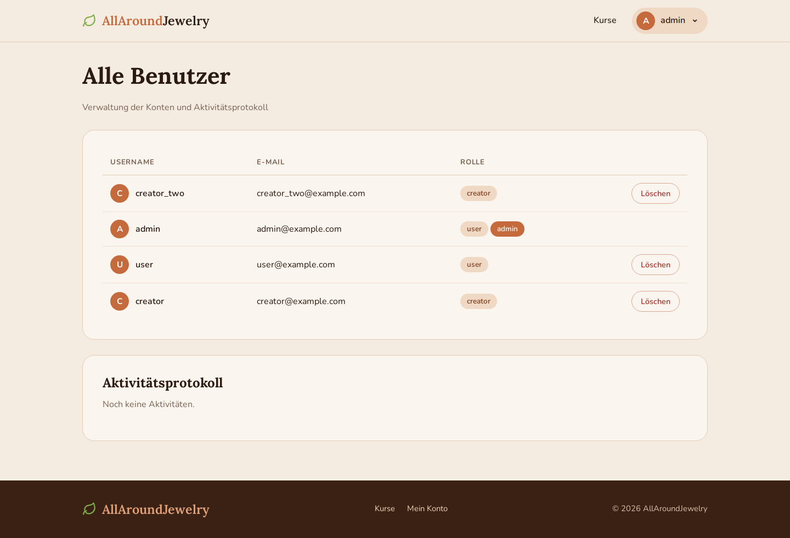

# Projektarbeit
Modul 223 | 25.09.2026 | Marharyta Oberemok | INA24B
## Problemstellung
Als Künstlerin, die Schmuck selber erstellt, bekomme ich immer Fragen, wie ich die einzelnen Schmuckstücke gemacht habe.
Es ist mir zu aufwändig, allen Interessierten denselben Prozess immer zu zeigen. Ausserdem wünschte ich mir gerne einen verallgemeinerten Austausch mit den anderen Künstlern.
## Projekt
* Domäne: Kunst und Buchungsverwaltung
* Name der Applikation: AllAroundJewelry
* Vision: AllAroundJewelry wird entwickelt, um die Schmuck- Macher sowie die Interessierte auf einer Plattform zu verbinden, welche den Austausch zwischen beiden erleichtert und fördert.
## Projektplanung: 1. MVP Iteration
Die wichtigste funktionale Anforderung für die erste Iteration ist die Erstellung und Verwaltung von einzelnen Kursen. Dies umfasst das Erstellen von Kursen und die entsprechende Buchung.
## Anforderungsanalyse
### Funktionale Anforderungen (priorisiert)
* Benutzer können sich registrieren und einloggen
* Benutzer können zu Schmuckersteller werden
* Kurse können erstellt, bearbeitet und gelöscht werden
* Kurse können von Benutzer gebucht werden
* Benutzer können ihr Profil bearbeiten und ihre E-Mail-Adresse ändern
* Benutzer können ihr Passwort zurücksetzen
### Qualitätsattribute
* Benutzerfreundlichkeit: Eine Buchung ist von der Kursübersicht aus in höchstens drei Klicks abgeschlossen.
* Skalierbarkeit: Unterstützung von mindestens 10.000 gleichzeitigen Benutzern.
* Sicherheit: Passwörter werden nur als bcrypt-Hash gespeichert; Kurse bearbeiten kann ausschliesslich der erstellende Schmuckersteller. 
* Datenkonsistenz: Bei zwei gleichzeitigen Reservierungen des letzten freien Platzes wird genau eine bestätigt.
* Kompatibilität: Unterstützung aller gängigen Webbrowser und mobilen Geräte.
### Benutzerrollen
* Benutzer: Kann alle öffentliche Kurse anschauen und buchen.
* Schmuckersteller: Kann eigene Kurse erstellen, bearbeiten und löschen, kann andere Kurse auch buchen.
## Locking und Transaktionen 
Kursbuchung: Beim Buchen von Kursen mit dem begrenzten Benutzeranzahl, muss geprüft werden, ob noch Plätze frei sind, und gleichzeitig die Buchung erstellt werden. Zwischen Prüfung und Speicherung kann ein anderer Benutzer denselben letzten Platz buchen (Race Condition). Deshalb wird der Kurs innerhalb einer Transaktion pessimistisch gesperrt (kurs.with_lock), damit die Platzzahl nie überschritten wird. Zusätzlich verhindert ein Unique Index auf (kurs_id, benutzer_id), dass jemand sich versehentlich doppelt anmeldet.
## ERM (Entity-Relationship-Model)
fk_users und fk_course sind in der Tabelle Unique Index, users.role und booking.status sind enums.

## Breadboards

## Fat-Marker-Sketches


---

# Nachtrag: Umsetzung und Prüfung (Stand 25.09.2026)
Die folgenden Abschnitte ergänzen die Dokumentation oben. Sie beschreiben, wie die erste Iteration umgesetzt wurde, wo und warum von der Planung abgewichen wurde, was noch offen ist und wie die Anforderungen geprüft wurden.

## Technischer Rahmen
* Ruby on Rails 8.1, SQLite als Datenbank
* Eigene Authentifizierung (Rails-Generator): Session-Cookie, `Current.user`, Passwörter mit `has_secure_password` (bcrypt)
* Autorisierung mit Pundit (`CoursePolicy`, `BookingPolicy`, `UserPolicy`)
* Aktivitätsprotokoll mit dem Gem `audited` (Kurse und Buchungen)
* Tests mit Minitest (Model-, Policy-, Controller- und Integrationstests)

## Rollen und Berechtigungen (umgesetzt)
Zusätzlich zu den geplanten Rollen gibt es den **Admin**. Der Admin ist keine eigene Rolle im Enum `users.role` (`user`, `creator`), sondern das Boolean-Feld `users.admin`.

| Aktion | Gast (nicht eingeloggte) | Benutzer | Schmuckersteller | Admin |
|---|---|---|---|---|
| Kursübersicht und Kursdetails ansehen | ✅ | ✅ | ✅ | ✅ |
| Kurs erstellen | ❌ | ❌ | ✅ | ✅ |
| Eigenen Kurs bearbeiten / löschen | ❌ | ❌ | ✅ | ✅ |
| Fremden Kurs bearbeiten / löschen | ❌ | ❌ | ❌ | ✅ |
| Kurs buchen (nicht voll, nicht bereits gebucht) | ❌ | ✅ | ✅ (nicht den eigenen) | ✅ |
| Eigene Buchung ansehen | ❌ | ✅ | ✅ | ✅ |
| Fremde Buchung ansehen | ❌ | ❌ | ❌ | ✅ |
| Eigene bestätigte Buchung stornieren | ❌ | ✅ | ✅ | ✅ |
| Profil bearbeiten (Benutzername, E-Mail) | ❌ | ✅ | ✅ | ✅ |
| Benutzerverwaltung und Aktivitätsprotokoll (`/admin/users`) | ❌ | ❌ | ❌ | ✅ |
| Benutzer löschen | ❌ | ❌ | ❌ | ✅ (nicht sich selbst) |

**Durchsetzung:**
* `before_action :require_authentication` im `ApplicationController` leitet Gäste zur Anmeldung um. Ausnahmen sind die Kursübersicht und die Kursdetails, Login, Registrierung und das Zurücksetzen des Passworts.
* Jede schützenswerte Controller-Action ruft `authorize` auf. Die Regeln stehen in den Pundit-Policies.
* Ein verweigerter Zugriff (`Pundit::NotAuthorizedError`) führt zu einer Weiterleitung zur Startseite mit der Meldung „Kein Zugriff.“.
* Die Ansicht blendet Knöpfe nur aus (z. B. „Bearbeiten“ nur für den Besitzer). Geschützt wird serverseitig. 

## ERM – aktueller Stand der Umsetzung
Das usprungliche ERM müsste ein paar Erweiterungen haben:


**Unterschiede zum geplanten ERM v2:**
Hauptsächlich sind zu fast jeder Tabelle c `reated_at` und `updated_at` hinzugefügt, `fk_users` und `fk_courses` sind nach `user_id` und `course_id` umgetauft (Rails-Namenskonvention) und zur Tabelle `Users` ist das Boolische Wert `admin` hinzugefügt.

Es sind auch zwei neue Tabellen entstanden, nämlich Tabelle `Audits` für das Aktivitätsprotokol und Tabelle `Sessions` für das Login.

## Breadboards und Screens der ersten Iteration
Die Seiten aus dem Breadboard (`breadboard_v2.jpg`) sind so umgesetzt:

| Breadboard | Route | Controller#Action |
|---|---|---|
| Landing Page / All Courses List | `/` bzw. `/courses` | `courses#index` |
| Log In | `/session/new` | `sessions#new` |
| Sign In (Registrierung) | `/users/new` | `users#new` |
| Course Details + „book a course“ | `/courses/:id` | `courses#show` |
| Confirmation + „Confirm“ | `/courses/:id/booking/new` | `bookings#new` → `bookings#create` |
| Thank You | `/bookings/:id` | `bookings#show` |
| User Account (Bookings List, Own courses list) | `/account` | `accounts#show` |
| Course Details + „cancel course booking“ | `/account` (Knopf „Stornieren“) bzw. `/bookings/:id` | `bookings#destroy` |
| Create course / Publish | `/courses/new` | `courses#new` / `#create` |
| Edit course / Save | `/courses/:id/edit` | `courses#edit` / `#update` |
| *(zusätzlich)* Profil bearbeiten | `/account/edit` | `accounts#edit` / `#update` |
| *(zusätzlich)* Passwort vergessen | `/passwords/new` | `passwords#new` |
| *(zusätzlich)* Benutzerverwaltung / Protokoll | `/admin/users` | `admin/users#index` |

Die Gestaltung orientiert sich an den Design-Entwürfen im Ordner `designs/`.

### Screens der Umsetzung

**Startseite (Gast und eingeloggt)**


**Kursdetails: ausgebucht und buchbar**


**Anmelden, Registrieren, Passwort vergessen**


**Kurs erstellen**


**Admin: Benutzerverwaltung und Aktivitätsprotokoll**


## Locking und Transaktionen, Umsetzung
Das Konzept oben ist in `app/models/booking_service.rb` umgesetzt:

```ruby
def self.book!(course, user)
  Course.transaction do
    course.lock!                            # Kurs pessimistisch sperren
    raise CourseFull if course.full?        # Prüfung innerhalb der Sperre

    existing = Booking.find_by(course: course, user: user)
    if existing
      existing.update!(status: "confirmed") # Falls storniert war, neu buchen
      existing
    else
      Booking.create!(course: course, user: user, status: "confirmed")
    end
  end
end
```

* **Transaktion:** Die Prüfung der freien Plätze und das Speichern der Buchung passieren in einer Transaktion. Wirft `CourseFull` eine Ausnahme, wird alles zurückgerollt und keine Buchung gespeichert. Der `BookingsController` fängt die Ausnahme ab und zeigt „Der Kurs ist inzwischen ausgebucht.“.
* **Pessimistisches Locking:** Statt `kurs.with_lock` wird `course.lock!` innerhalb von `Course.transaction` verwendet.
* **Doppelbuchung:** Zwei Ebenen verhindern, dass sich jemand doppelt anmeldet:
  1. Die Validierung in `Booking` erlaubt pro Benutzer und Kurs nur eine *bestätigte* Buchung.
  2. Der Unique Index auf `bookings (user_id, course_id)` sichert das zusätzlich auf Datenbankebene ab.
* **Stornierung und Neubuchung:** Beim Stornieren wird die Buchung nicht gelöscht, sondern auf `cancelled` gesetzt. Der Unique Index gilt für alle Status, deshalb wird bei einer Neubuchung die bestehende Zeile wieder auf `confirmed` gesetzt, statt eine zweite anzulegen.

## Erreichter Stand
**Funktionale Anforderungen**

| # | Anforderung | Stand |
|---|---|---|
| 1 | Benutzer können sich registrieren und einloggen | ✅ (inkl. Logout) |
| 2 | Benutzer können zu Schmuckersteller werden | +- teilweise: Die Rolle wird bei der Registrierung gewählt, später lässt sie sich nicht mehr ändern |
| 3 | Kurse können erstellt, bearbeitet und gelöscht werden | ✅ (nur Besitzer und Admin) |
| 4 | Kurse können von Benutzer gebucht werden | ✅ |
| 5 | Benutzer können ihr Profil bearbeiten und ihre E-Mail-Adresse ändern | ✅ |
| 6 | Benutzer können ihr Passwort zurücksetzen | ✅ (E-Mail mit Link in Terminal) |

**Zusätzlich umgesetzt:**
* Admin Bereich mit Benutzerverwaltung
* Aktivitätsprotokoll: Wer hat wann einen Kurs oder eine Buchung erstellt, geändert oder gelöscht
* Stornierung von Buchungen
* Anzeige der freien Plätze mit Belegungsbalken
* Automatisierte Tests

## Begründete Abweichungen
1. **Admin zusätzlich zu Benutzer und Schmuckersteller:** Für die Vereinheitliung soll der Admin nicht als Boolean-Feld gesetzt werden, sondern als dritter Enum-Wert, weil Admin eine weitere Rolle ist.
2. **Registrierung ohne separates Feld „Name“:** Das Breadboard sah „name“ und „username“ vor. Umgesetzt ist nur `username`, weil das Modell kein Namensfeld hat. 
3. **Spaltennamen im ERM:** `user_id` und `course_id` statt `fk_users` und `fk_course`, sowie andere Erweiterungen an der ERM (siehe ERM).
4. **Kursbilder als Platzhalter:** Die Design-Entwürfe zeigen Fotos. Weil es noch keinen Bild-Upload gibt, zeigen die Kurse Platzhalter-Muster in CSS.

## Offene Punkte
**Aus den Design-Entwürfen, im Modell noch nicht vorhanden:**
* Format und Ort (Online / Offline, z. B. „Atelier in Bern“) sowie der Meeting-Link sollten für mehr Infos hinzugefügt werden und könnten eigene Zeilen in der Tabelle `Courses` haben.
* Niveau (z. B. „Anfänger“), Kategorie (Perlen, Draht, Harz …) und Schlagwörter würden für die Einstufung helfen
* Kursbilder Hochladen wäre eine gute Ergänzung
* Vollständiger Name und Kurzbiografie der Kursleitung für Creators
* „Passwort bestätigen“ bei der Registrierung

**Funktion und Sicherheit:**
* **Rolle nicht änderbar:** Ein Benutzer kann nach der Registrierung nicht mehr zum Schmuckersteller werden.
* **Kursdaten:** Kurse in der Vergangenheit können noch gebucht werden. Start- und Enddatum sind keine Pflichtfelder.
* **Benutzer löschen:** Löscht ein Admin einen Schmuckersteller, werden dessen Kurse samt den Buchungen anderer Teilnehmender mitgelöscht, ohne dass diese benachrichtigt werden.

**Qualität und Betrieb:**
* **Nebenläufigkeit:** Die Tests prüfen die Buchungslogik nur nacheinander. Ein echter Test mit gleichzeitigen Threads fehlt.

## Prüfung der Anforderungen und Ergebnisse
**Funktionale Anforderungen**

| Anforderung | Prüfung | Ergebnis |
|---|---|---|
| Registrieren | `UsersControllerTest`: erfolgreich, doppelte E-Mail, fehlendes Passwort; `AuthenticationTest`: doppelter Benutzername | ✅ |
| Einloggen / Ausloggen | `SessionsControllerTest`: richtige und falsche Daten, Logout; `AuthenticationTest`: unbekannter Benutzer | ✅ |
| Zu Schmuckersteller werden | `UsersControllerTest` „create als creator“; `AccountsControllerTest` „update ignoriert role und admin“ | ◐ nur bei der Registrierung möglich |
| Kurse erstellen / bearbeiten / löschen | `CoursesControllerTest` (27 Tests), `CoursePolicyTest` | ✅ |
| Kurse buchen | `BookingsControllerTest`, `BookingsFlowTest`, `BookingServiceTest`, `BookingPolicyTest` | ✅ |
| Buchung stornieren | `BookingsControllerTest` „destroy …“ | ✅ |
| Profil und E-Mail bearbeiten | `AccountsControllerTest` „update ändert eigenes Profil“, ungültige Daten | ✅ |
| Passwort zurücksetzen | `PasswordsControllerTest` (7 Tests) | ✅ |

**Qualitätsattribute**

| Qualitätsattribut | Prüfung | Ergebnis |
|---|---|---|
| Benutzerfreundlichkeit: Buchung in höchstens drei Klicks | Manuell eingeloggt: Kursübersicht → Kurs (1) → „Kurs buchen“ (2) → „Verbindlich buchen“ (3) | ✅ |
| Skalierbarkeit: 10'000 gleichzeitige Benutzer | Nicht geprüft | ❌ |
| Sicherheit: Passwörter als bcrypt-Hash | `has_secure_password`; in der Datenbank steht nur `password_digest` | ✅ |
| Sicherheit: Nur der Ersteller bearbeitet Kurse | `CoursePolicyTest`; `AuthorizationTest` (PATCH/DELETE auf fremden Kurs als User und Gast); `CoursesControllerTest` (als fremder Schmuckersteller) | ✅ (Admin darf auch) |
| Datenkonsistenz: Letzter Platz wird genau einmal vergeben | `BookingServiceTest`: letzter Platz, zweite Person erhält `CourseFull`, bei `CourseFull` keine Buchung in der DB | ◐ Logik und Rollback bestanden; gleichzeitige Zugriffe nicht mit Threads getestet |
| Kompatibilität: Browser und mobile Geräte | Screenshots in Chromium bei 1440 px und 400 px; responsives Layout | ◐ Chromium geprüft; andere Browser nicht getestet, alte Browser durch `allow_browser` gesperrt |

**Berechtigungen und Schutz vor direkten Requests**

| Prüfung | Test | Ergebnis |
|---|---|---|
| PATCH / DELETE auf fremden Kurs | `CoursesControllerTest` (fremder Schmuckersteller), `AuthorizationTest` (User, Gast) | ✅ verweigert |
| DELETE auf fremde Buchung | `BookingsControllerTest` (fremder Schmuckersteller), `AuthorizationTest` (Admin) | ✅ verweigert |
| GET `/admin/users` als Nicht-Admin | `AuthorizationTest` (User, beide Schmuckersteller), `Admin::UsersControllerTest` (Gast) | ✅ verweigert |
| Admin löscht sich selbst | `Admin::UsersControllerTest`, `UserPolicyTest` | ✅ verweigert |

**Locking, Transaktionen und Aktivitätsprotokoll**

| Prüfung | Test | Ergebnis |
|---|---|---|
| Bei `CourseFull` landet keine Buchung in der DB | `BookingServiceTest` „bei CourseFull wird keine Buchung gespeichert“ | ✅ |
| Stornierte Buchung bleibt bei vollem Kurs storniert | `BookingServiceTest` | ✅ |
| Doppelte bestätigte Buchung wird abgelehnt | `BookingTest` | ✅ |
| Audit bei Kurs-Erstellung, Buchung und Stornieren mit gesetztem `audit.user` | `AuditLogTest` | ✅ |
